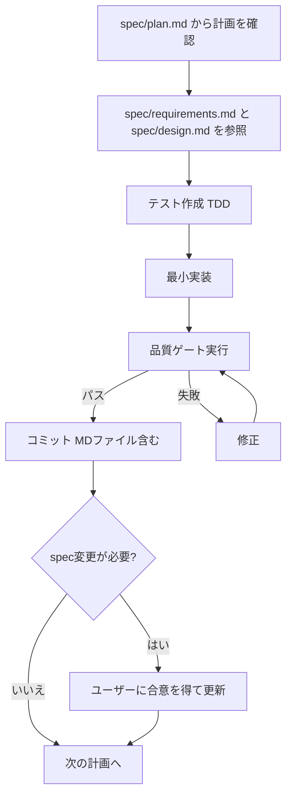

# vibe-coding-templete

使用駆動開発（Usage-Driven Development）のためのAIエージェント設定テンプレート。

## 対応エージェント

| エージェント | 設定ファイル | 読み込み方式 |
|---|---|---|
| **Claude Code** | `CLAUDE.md` | 自動読み込み |
| **Cursor** | `.cursor/rules/usage-driven-development.mdc` | 自動読み込み（alwaysApply） |
| **Google Antigravity** | `.antigravity/rules.md` + `GEMINI.md` | rules.md は自動、GEMINI.md はグローバル設定 |
| **GitHub Copilot** | `.github/copilot-instructions.md` | 自動読み込み |
| **OpenAI Codex** | `AGENTS.md` | 自動読み込み |

## セットアップ

### 1. テンプレートからプロジェクトを作成

```bash
# このリポジトリをコピー
gh repo create my-project --template cho5butter/vibe-coding-templete
cd my-project
```

### 2. specを記述

`spec/` フォルダ内のテンプレートを埋める:

- `spec/requirements.md` — 要件定義（ユーザーストーリー、機能要件、非機能要件）
- `spec/design.md` — 設計（アーキテクチャ、データモデル、API設計）
- `spec/plan.md` — 実装計画（1セッション＝1計画の粒度で分割）

各ファイルは原則1ファイル（Markdown＋Mermaid図）で管理する。膨大になった場合のみ分割可。

### 3. プロジェクト固有のコマンドを設定

`scripts/` ディレクトリ内の各スクリプトを編集し、`TODO` コメントの箇所をプロジェクトに合わせて書き換える:

- `scripts/test.sh` — テストコマンド
- `scripts/lint.sh` — リント・フォーマットコマンド
- `scripts/build.sh` — ビルドコマンド
- `scripts/quality-gate.sh` — 上記3つを順に実行（通常は編集不要）

### 4. GitHub Actions の設定

`.github/workflows/quality-gate.yml` のセットアップステップをプロジェクトに合わせて編集する。

## ワークフロー

すべてのAIエージェントは以下のワークフローに従う:



### 計画の粒度

- **1セッション＝1計画**: AIエージェントの1回のセッションで完了できるサイズ
- **明確な完了条件**: テスト・品質ゲートで検証可能な成果物
- **コミット必須**: 計画実行後は必ずコミット（MDファイルを含む）
- **spec変更はユーザー合意**: specファイルの変更はユーザーの合意を得てから

## コミットメッセージ規約

```
<種別>: <変更内容の要約>
```

| 種別 | 用途 |
|---|---|
| `機能` | 新機能の追加 |
| `修正` | バグ修正 |
| `改善` | 既存機能の改善 |
| `整理` | リファクタリング |
| `テスト` | テストの追加・修正 |
| `文書` | ドキュメントの変更 |
| `設定` | 設定ファイルの変更 |
| `計画` | 計画の追加・更新 |

## ディレクトリ構成

```
.
├── CLAUDE.md                          # Claude Code 用ルール
├── AGENTS.md                          # OpenAI Codex 用ルール
├── GEMINI.md                          # Gemini CLI / Antigravity 用コンテキスト
├── spec/
│   ├── requirements.md                # 要件定義（Markdown＋Mermaid）
│   ├── design.md                      # 設計（Markdown＋Mermaid）
│   └── plan.md                        # 実装計画（1セッション＝1計画）
├── .cursor/
│   └── rules/
│       └── usage-driven-development.mdc  # Cursor 用ルール
├── .antigravity/
│   └── rules.md                       # Google Antigravity 用ルール
├── .github/
│   ├── copilot-instructions.md        # GitHub Copilot 用ルール
│   ├── PULL_REQUEST_TEMPLATE.md       # PRテンプレート
│   └── workflows/
│       └── quality-gate.yml           # CI: 品質ゲート
└── scripts/
    ├── test.sh                        # テスト実行
    ├── lint.sh                        # リント・フォーマット
    ├── build.sh                       # ビルド確認
    └── quality-gate.sh                # 品質ゲート（全実行）
```
