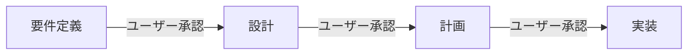
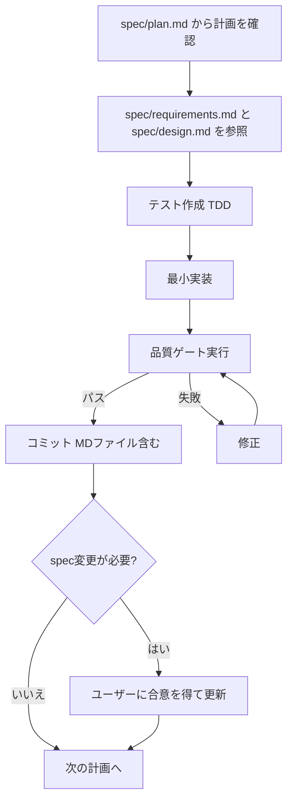

# vibe-coding-templete

[](LICENSE)
[](https://github.com/cho5butter/vibe-coding-templete/actions/workflows/quality-gate.yml)

仕様駆動開発（Spec-Driven Development）のためのAIエージェント設定テンプレート。

[](https://github.com/cho5butter/vibe-coding-templete/generate)

```bash
# または CLI から
gh repo create my-project --template cho5butter/vibe-coding-templete
```

## 対応エージェント

| エージェント | 設定ファイル | 読み込み方式 |
|---|---|---|
| **Claude Code** | `CLAUDE.md` | 自動読み込み |
| **Cursor** | `.cursor/rules/usage-driven-development.mdc` | 自動読み込み（alwaysApply） |
| **Devin** | `AGENTS.md` + `REVIEW.md` + `.devin/` | AGENTS.md で共通ルール、REVIEW.md でPRレビュー指示 |
| **Google Antigravity** | `.antigravity/rules.md` + `GEMINI.md` | rules.md は自動、GEMINI.md はグローバル設定 |
| **GitHub Copilot** | `.github/copilot-instructions.md` | 自動読み込み |
| **OpenAI Codex** | `AGENTS.md` | 自動読み込み |

すべてのエージェントは共通のワークフロー定義（`spec/workflow.md`）を参照する。
各エージェント用ファイルは簡潔なルール要約のみを含み、詳細は `spec/workflow.md` に集約されている。

## セットアップ

### 1. テンプレートからプロジェクトを作成

上部の **Use this template** ボタン、または CLI（`gh repo create --template`）でリポジトリを作成し、クローンする。

### 2. specを記述

`spec/` フォルダ内のテンプレートを埋める:

| ファイル | 内容 |
|----------|------|
| `spec/requirements.md` | 要件定義（ユーザーストーリー、機能要件、非機能要件、受け入れ基準） |
| `spec/design.md` | 設計（アーキテクチャ、データモデル、API設計、ADR） |
| `spec/plan.md` | 実装計画（1セッション＝1計画の粒度で分割、依存関係・リスク明示） |
| `spec/workflow.md` | ワークフロー定義（全エージェント共通ルール、参照用） |

### 3. pre-commitフックを有効化

```bash
bash scripts/setup-hooks.sh
```

コミット時に品質ゲート（リント→ビルド→テスト）が**自動実行**される。

### 4. プロジェクト固有のコマンドを設定

`scripts/` ディレクトリ内の各スクリプトを編集し、`TODO` コメントをプロジェクトに合わせて書き換える:

| スクリプト | 用途 |
|-----------|------|
| `scripts/lint.sh` | リント・フォーマット |
| `scripts/build.sh` | ビルド |
| `scripts/test.sh` | テスト |
| `scripts/quality-gate.sh` | 上記3つを順に実行（通常は編集不要） |

### 5. GitHub Actions の設定

`.github/workflows/quality-gate.yml` のセットアップステップをプロジェクトに合わせて編集する。

## ワークフロー

### フェーズゲート



各フェーズ間でユーザーの明示的な承認が必要。詳細は `spec/workflow.md` を参照。

### 実装ワークフロー



## コミットメッセージ規約

```
<種別>: <変更内容の要約>
```

| 種別 | 用途 |
|---|---|
| `機能` | 新機能の追加 |
| `修正` | バグ修正 |
| `改善` | 既存機能の改善 |
| `整理` | リファクタリング |
| `テスト` | テストの追加・修正 |
| `文書` | ドキュメントの変更 |
| `設定` | 設定ファイルの変更 |
| `計画` | 計画の追加・更新 |

## ディレクトリ構成

```
.
├── CLAUDE.md                             # Claude Code 用ルール（簡潔版）
├── AGENTS.md                             # Codex / Devin 共通ルール（簡潔版）
├── GEMINI.md                             # Gemini CLI / Antigravity 用コンテキスト
├── REVIEW.md                             # Devin Review 用 PRレビュー指示
├── spec/
│   ├── requirements.md                   # 要件定義（Markdown＋Mermaid）
│   ├── design.md                         # 設計（Markdown＋Mermaid＋ADR）
│   ├── plan.md                           # 実装計画（1セッション＝1計画）
│   └── workflow.md                       # ワークフロー定義（全エージェント共通）
├── .cursor/
│   └── rules/
│       └── usage-driven-development.mdc  # Cursor 用ルール（簡潔版）
├── .antigravity/
│   └── rules.md                          # Google Antigravity 用ルール（簡潔版）
├── .devin/
│   └── wiki.json                         # Devin DeepWiki 生成設定
├── .gitignore                            # Git除外設定（複数技術スタック対応）
├── .github/
│   ├── copilot-instructions.md           # GitHub Copilot 用ルール（簡潔版）
│   ├── ISSUE_TEMPLATE/
│   │   ├── bug_report.md                 # バグ報告テンプレート
│   │   └── feature_request.md            # 機能リクエストテンプレート
│   ├── PULL_REQUEST_TEMPLATE.md          # PRテンプレート（共通）
│   ├── PULL_REQUEST_TEMPLATE/
│   │   └── devin_pr_template.md          # Devin 専用 PRテンプレート
│   └── workflows/
│       └── quality-gate.yml              # CI: 品質ゲート
├── hooks/
│   └── pre-commit                        # pre-commitフック（品質ゲート自動実行）
└── scripts/
    ├── lint.sh                           # リント・静的解析
    ├── build.sh                          # ビルド確認
    ├── test.sh                           # テスト実行
    ├── quality-gate.sh                   # 品質ゲート（全実行）
    └── setup-hooks.sh                    # フックのセットアップ
```
