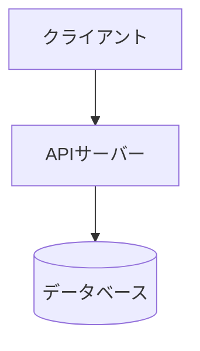
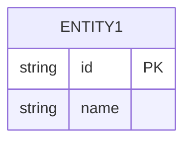
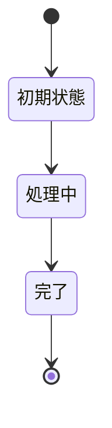

# 設計

<!-- プロジェクトの設計をここに記述する -->
<!-- Mermaid 図を活用してアーキテクチャ・データフロー・状態遷移を表現すること -->

## アーキテクチャ概要



## ディレクトリ構成

```
.
├── spec/           # 要件・設計・計画
├── src/            # ソースコード
├── tests/          # テスト
└── scripts/        # ビルド・テスト・リントスクリプト
```

<!-- TODO: プロジェクトに合わせて書き換え -->

## データモデル



## 状態遷移図



## API設計

<!-- エンドポイント一覧（該当する場合） -->

| メソッド | パス | 説明 |
|----------|------|------|
| <!-- GET/POST/PUT/DELETE --> | <!-- /api/xxx --> | <!-- 説明 --> |

## 技術選定

| カテゴリ | 技術 | 選定理由 |
|----------|------|----------|
| <!-- 言語 --> | <!-- 例: TypeScript --> | <!-- 理由 --> |

## セキュリティ設計

<!-- 認証・認可・入力検証等のセキュリティ方針 -->
