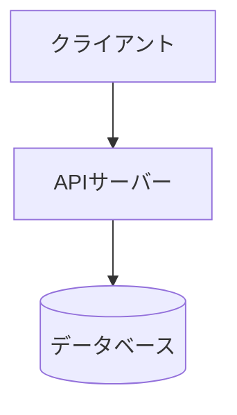
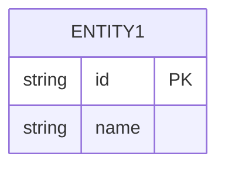
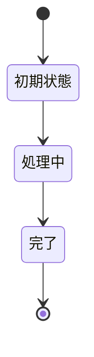

# 設計

<!-- プロジェクトの設計をここに記述する -->
<!-- Mermaid 図を活用してアーキテクチャ・データフロー・状態遷移を表現すること -->

## アーキテクチャ概要



## ディレクトリ構成

```
.
├── spec/           # 要件・設計・計画
├── src/            # ソースコード
├── tests/          # テスト
└── scripts/        # ビルド・テスト・リントスクリプト
```

<!-- TODO: プロジェクトに合わせて書き換え -->

## データモデル



## 状態遷移図



## API設計

<!-- エンドポイント一覧（該当する場合） -->

| メソッド | パス | 説明 | リクエスト | レスポンス |
|----------|------|------|-----------|-----------|
| <!-- GET/POST/PUT/DELETE --> | <!-- /api/xxx --> | <!-- 説明 --> | <!-- 型/例 --> | <!-- 型/例 --> |

## 技術選定

| カテゴリ | 技術 | 選定理由 |
|----------|------|----------|
| <!-- 言語 --> | <!-- 例: TypeScript --> | <!-- 理由 --> |

<!-- デフォルトの技術スタックは spec/workflow.md を参照 -->
<!-- デフォルトから変更する場合は、ここに選定理由を記録すること -->

## セキュリティ設計

<!-- 認証・認可・入力検証等のセキュリティ方針 -->

### 認証・認可

<!-- 認証方式、セッション管理、権限モデル等 -->

### 入力検証

<!-- バリデーション方針、サニタイズ方針等 -->

### データ保護

<!-- 暗号化、個人情報の取り扱い等 -->

## ADR（Architecture Decision Records）

<!-- 重要な設計判断を記録する -->
<!-- 設計の「なぜそうしたか」を後から追跡可能にするため -->

### ADR-001: <!-- タイトル -->

**ステータス**: <!-- 提案 | 承認 | 却下 | 廃止 -->
**日付**: <!-- YYYY-MM-DD -->

**コンテキスト**: <!-- どのような状況・課題に直面したか -->

**選択肢:**
1. <!-- 選択肢A: 説明 -->
2. <!-- 選択肢B: 説明 -->

**決定**: <!-- どの選択肢を採用したか -->

**理由**: <!-- なぜその選択肢を採用したか -->

**影響**: <!-- この決定が及ぼす影響・トレードオフ -->

## エラーハンドリング方針

<!-- システム全体のエラーハンドリング戦略 -->

| エラー種別 | 対処方針 | ユーザーへの表示 |
|-----------|---------|----------------|
| バリデーションエラー | <!-- 例: 400レスポンス --> | <!-- 例: フィールド単位のエラーメッセージ --> |
| 認証エラー | <!-- 例: 401レスポンス --> | <!-- 例: ログイン画面にリダイレクト --> |
| サーバーエラー | <!-- 例: 500レスポンス + ログ --> | <!-- 例: 汎用エラーメッセージ --> |
