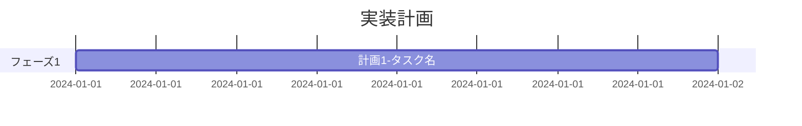
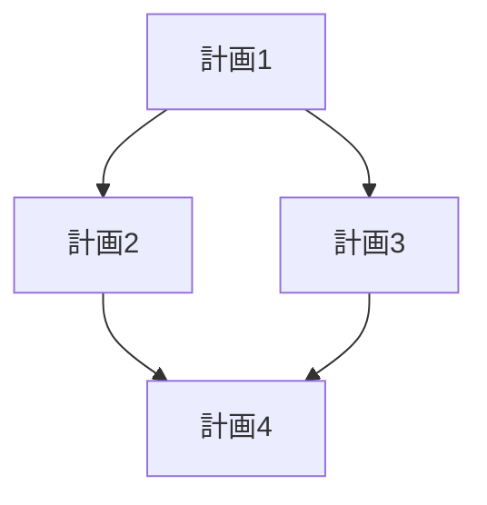

# 計画

<!-- 実装計画をここに記述する -->
<!-- 各計画は「1セッション＝1計画」の粒度に分割すること -->
<!-- AIエージェントが1回のセッションで完了できるサイズに調整すること -->

## 計画一覧

## 依存関係図

<!-- 計画間の依存関係を可視化する -->

## リスク・ブロッカー

<!-- 事前に特定されたリスクとその対策 -->

| ID | リスク | 影響度 | 発生確率 | 対策 |
|----|--------|--------|---------|------|
| R-001 | <!-- リスク内容 --> | <!-- 高/中/低 --> | <!-- 高/中/低 --> | <!-- 対策 --> |

## 計画テンプレート

<!-- 以下のテンプレートをコピーして各計画を記述する -->

---

### 計画 X: タイトル

**ステータス**: 未着手 | 進行中 | 完了

**目的**: <!-- この計画で達成すること -->

**前提条件**: <!-- この計画を開始するために必要な条件 -->

**依存する計画**: <!-- 例: 計画1、計画3 -->

**タスク**:

- [ ] タスク1: <!-- 具体的な作業内容 -->
- [ ] タスク2: <!-- 具体的な作業内容 -->
- [ ] タスク3: <!-- 具体的な作業内容 -->

**完了条件**:
- [ ] テストが通ること（テストファイル: <!-- テストファイルパス -->）
- [ ] 品質ゲートをパスすること
- [ ] コミット済みであること

**影響範囲**: <!-- 変更が影響するファイル・モジュール -->

**テスト方針**: <!-- この計画で書くべきテストの概要 -->

---

## 計画の粒度ガイドライン

計画は以下の基準で分割すること:

1. **1セッション＝1計画**: AIエージェントの1回のセッションで完了できるサイズ
2. **明確な完了条件**: テスト・品質ゲートで検証可能な成果物がある
3. **独立性**: 可能な限り他の計画と独立して実行可能
4. **TDD対応**: テスト作成→実装→検証のサイクルが1計画内で完結する

### 粒度の目安

- 小: 単一関数・コンポーネントの追加（1-3ファイル変更）
- 中: 1機能の実装（3-7ファイル変更）
- 大: 複数機能にまたがる変更（分割を検討すること）
