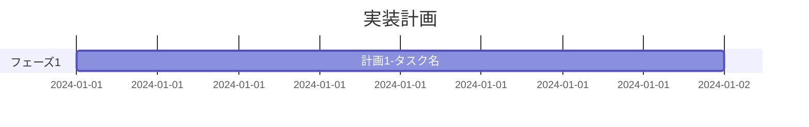
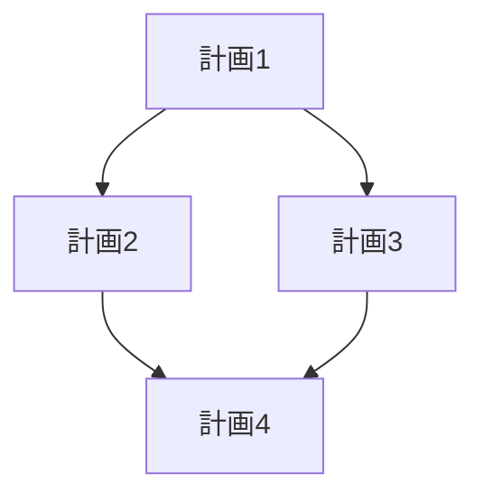

# 計画

<!-- 実装計画をここに記述する -->
<!-- 各計画は「1セッション＝1計画」の粒度に分割すること -->
<!-- AIエージェントが1回のセッションで完了できるサイズに調整すること -->

## 計画一覧

```mermaid
gantt
    title 実装計画
    dateFormat YYYY-MM-DD
    section フェーズ1
    %% TODO: 計画を記述
    計画1-タスク名 :task1, 2024-01-01, 1d
```

## 依存関係図

<!-- 計画間の依存関係を可視化する -->

```mermaid
graph TD
    %% TODO: 依存関係を記述
    P1[計画1] --> P2[計画2]
    P1 --> P3[計画3]
    P2 --> P4[計画4]
    P3 --> P4
```

## リスク・ブロッカー

<!-- 事前に特定されたリスクとその対策 -->

| ID | リスク | 影響度 | 発生確率 | 対策 |
|----|--------|--------|---------|------|
| R-001 | <!-- リスク内容 --> | <!-- 高/中/低 --> | <!-- 高/中/低 --> | <!-- 対策 --> |

## 計画テンプレート

<!-- 以下のテンプレートをコピーして各計画を記述する -->

---

### 計画 X: タイトル

**ステータス**: 未着手 | 進行中 | 完了

**目的**: <!-- この計画で達成すること -->

**前提条件**: <!-- この計画を開始するために必要な条件 -->

**依存する計画**: <!-- 例: 計画1、計画3 -->

**タスク**:

- [ ] タスク1: <!-- 具体的な作業内容 -->
- [ ] タスク2: <!-- 具体的な作業内容 -->
- [ ] タスク3: <!-- 具体的な作業内容 -->

**完了条件**:
- [ ] テストが通ること（テストファイル: <!-- テストファイルパス -->）
- [ ] 品質ゲートをパスすること
- [ ] コミット済みであること

**影響範囲**: <!-- 変更が影響するファイル・モジュール -->

**テスト方針**: <!-- この計画で書くべきテストの概要 -->

---

## 計画の粒度ガイドライン

計画は以下の基準で分割すること:

1. **1セッション＝1計画**: AIエージェントの1回のセッションで完了できるサイズ
2. **明確な完了条件**: テスト・品質ゲートで検証可能な成果物がある
3. **独立性**: 可能な限り他の計画と独立して実行可能
4. **TDD対応**: テスト作成→実装→検証のサイクルが1計画内で完結する

### 粒度の目安

- 小: 単一関数・コンポーネントの追加（1-3ファイル変更）
- 中: 1機能の実装（3-7ファイル変更）
- 大: 複数機能にまたがる変更（分割を検討すること）

---

## 最終計画（固定・必須）: 脆弱性レビュー

**ステータス**: 未着手 | 進行中 | 完了

**目的**: すべての実装計画完了後、リリース/マージ前に実装とパッケージ両面の脆弱性レビューを実施する

**前提条件**: 上記すべての実装計画が完了していること

**依存する計画**: 上記すべての計画

**タスク**:

- [ ] 実装の脆弱性レビュー（OWASP Top 10: インジェクション、XSS、認証/認可不備、機微情報露出、SSRF 等）
- [ ] 入力検証・出力エスケープ・認可チェックの抜け漏れを確認
- [ ] 秘密情報のハードコード・ログ流出・不要な権限付与がないか確認
- [ ] パッケージ脆弱性スキャンを実行（言語に応じて `npm audit` / `pnpm audit` / `bun audit` / `pip-audit` / `govulncheck ./...` / `cargo audit` 等）
- [ ] GitHub の Security タブ（Dependabot アラート）を確認
- [ ] High / Critical の脆弱性はすべて解消、または明示的に保留判断（理由付き）した
- [ ] レビュー結果を本計画の末尾またはPR本文に記録

**完了条件**:
- [ ] 実装・パッケージ両面の脆弱性レビュー結果が記録されている
- [ ] High / Critical の脆弱性が残っていない（または保留理由が明記されている）

**影響範囲**: プロジェクト全体

**テスト方針**: 脆弱性スキャナの実行結果が完了条件

**レビュー結果（記入欄）**:

<!-- 実施日: YYYY-MM-DD -->
<!-- 実装レビュー結果: -->
<!-- パッケージスキャン結果: -->
<!-- 対応内容: -->

---

> **重要**: この「脆弱性レビュー」計画は実装計画のテンプレートとして固定されている。プロジェクト固有の計画を追加する際も、必ずこの計画を最後の計画として残すこと。詳細は `spec/workflow.md` の「実装計画末尾の脆弱性レビュー」セクションを参照。
