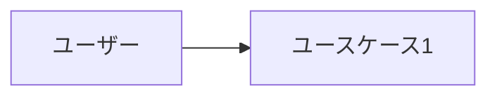

# 要件定義

<!-- プロジェクトの要件をここに記述する -->
<!-- Mermaid 図を活用して視覚的に表現すること -->

## プロジェクト概要

<!-- プロジェクトの目的・背景を記述 -->

## ユーザーストーリー

<!-- ユーザー視点での要件を記述 -->
<!-- 例: 「ユーザーとして、〇〇できるようにしたい。なぜなら△△だから。」 -->

## 機能要件

<!-- 実装すべき機能を一覧化 -->

| ID | 機能名 | 説明 | 優先度 |
|----|--------|------|--------|
| F-001 | <!-- 機能名 --> | <!-- 説明 --> | <!-- 高/中/低 --> |

## 非機能要件

<!-- パフォーマンス、セキュリティ、可用性など -->

## ユースケース図

## 用語集

<!-- プロジェクト固有の用語を定義 -->

| 用語 | 定義 |
|------|------|
| <!-- 用語 --> | <!-- 定義 --> |
