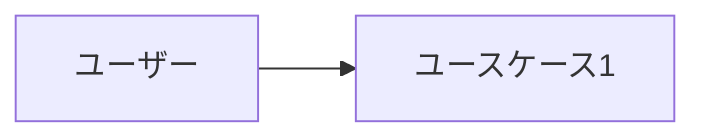

# 要件定義

<!-- プロジェクトの要件をここに記述する -->
<!-- Mermaid 図を活用して視覚的に表現すること -->
<!-- 各機能要件には受け入れ基準を必ず定義すること -->

## プロジェクト概要

<!-- プロジェクトの目的・背景を記述 -->

### 目的

<!-- このプロジェクトが解決する課題は何か -->

### 背景

<!-- なぜこのプロジェクトが必要なのか -->

### ターゲットユーザー

<!-- 誰がこのシステムを使うのか。ペルソナがあれば記述 -->

## ユーザーストーリー

<!-- ユーザー視点での要件を記述 -->
<!-- フォーマット: 「<ユーザー種別>として、<目的>のために、<機能>がほしい」 -->

| ID | ユーザー種別 | 目的 | 機能 | 優先度 |
|----|------------|------|------|--------|
| US-001 | <!-- 種別 --> | <!-- 目的 --> | <!-- 機能 --> | <!-- 高/中/低 --> |

## 機能要件

<!-- 実装すべき機能を一覧化 -->
<!-- 各機能には受け入れ基準（Acceptance Criteria）を必ず含めること -->

### F-001: <!-- 機能名 -->

**説明**: <!-- 機能の詳細説明 -->
**優先度**: <!-- 高/中/低 -->

**受け入れ基準:**
- [ ] <!-- Given-When-Then 形式で記述 -->
- [ ] <!-- 例: ユーザーがログインフォームに正しい認証情報を入力したとき、ダッシュボードにリダイレクトされる -->

## 非機能要件

<!-- パフォーマンス、セキュリティ、可用性など -->

| ID | カテゴリ | 要件 | 測定基準 |
|----|---------|------|---------|
| NFR-001 | パフォーマンス | <!-- 例: ページ読み込み時間 --> | <!-- 例: 3秒以内 --> |
| NFR-002 | セキュリティ | <!-- 例: 認証方式 --> | <!-- 例: OAuth 2.0準拠 --> |
| NFR-003 | 可用性 | <!-- 例: 稼働率 --> | <!-- 例: 99.9% --> |

## ユースケース図

## スコープ外

<!-- 明確にスコープ外とする事項を列挙する -->
<!-- これにより、AIエージェントが不要な機能を実装することを防ぐ -->

- <!-- 例: モバイルアプリ対応は本フェーズではスコープ外 -->

## 制約事項

<!-- 技術的・ビジネス的な制約を列挙する -->

- <!-- 例: 既存のXXX APIとの互換性を維持する必要がある -->

## 用語集

<!-- プロジェクト固有の用語を定義 -->

| 用語 | 定義 |
|------|------|
| <!-- 用語 --> | <!-- 定義 --> |
