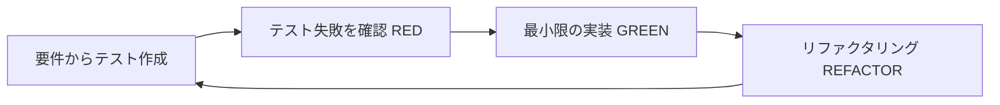

# 仕様駆動開発（SDD）ワークフロー詳細

このドキュメントはすべてのAIエージェントが従うべきワークフローの詳細定義である。
各エージェント用設定ファイル（CLAUDE.md, AGENTS.md 等）から参照される。

## フェーズゲート式ワークフロー

プロジェクトは以下の4フェーズで進行する。**次のフェーズに進む前に、必ずユーザーの明示的な承認を得ること。**


### フェーズ1: 要件定義

**目的**: `spec/requirements.md` を完成させる

**進め方:**
- ユーザーに繰り返し質問し、曖昧さ・不足がなくなるまで要件を精査する
- 推測で補完せず、不明点は必ずユーザーに確認する
- 以下がすべて明確になるまで完了としない:
  - プロジェクトの目的・背景
  - ターゲットユーザー
  - 機能要件（優先度付き）
  - 非機能要件（パフォーマンス、セキュリティ、可用性等）
  - ユースケース・ユーザーストーリー
  - 用語定義
  - 受け入れ基準（各機能要件に対して）

**完了条件**: ユーザーが `spec/requirements.md` の内容を承認すること

### フェーズ2: 設計

**目的**: `spec/design.md` を完成させる

**進め方:**
- 要件定義に基づいてアーキテクチャ・データモデル・API設計等を策定する
- Mermaid図を活用して視覚的に表現する
- 設計の選択肢がある場合はユーザーに提示して判断を仰ぐ
- 重要な設計判断はADR（Architecture Decision Record）として記録する

**完了条件**: ユーザーが `spec/design.md` の内容を承認すること

### フェーズ3: 計画

**目的**: `spec/plan.md` を完成させる

**進め方:**
- 設計に基づいて実装タスクを分割する
- 各計画は「1セッション＝1計画」の粒度にする
- 各計画に明確な完了条件を含める
- 計画間の依存関係を明示する
- リスク・ブロッカーを事前に特定する

**完了条件**: ユーザーが `spec/plan.md` の内容を承認すること

### フェーズ4: 実装

**進め方:**
1. `spec/plan.md` から次の計画を確認する
2. 要件（`spec/requirements.md`）と設計（`spec/design.md`）を参照する
3. テストを先に書く（TDD — 詳細は後述）
4. 最小限の実装を行う
5. `bash scripts/quality-gate.sh` を実行
6. すべてパスしたらコミット（**MDファイルを含める**）
7. 失敗したら修正して再実行
8. specの変更が必要ならユーザーに合意を得て更新

**フェーズ間の承認ルール:**
- 各フェーズの成果物をユーザーに提示し、明示的な承認を得ること
- 承認なく次のフェーズに進んではならない
- 前のフェーズに戻る必要がある場合も、ユーザーに合意を得ること

## TDD（テスト駆動開発）ガイドライン

AIエージェントによる開発では、TDDが特に重要である。テストはAIの出力品質を保証する最も効果的な手段である。

### TDDサイクル



### AIエージェント向けTDDルール

1. **テストは要件のみから作成する**: 実装コードを見ずに、`spec/requirements.md` の要件・受け入れ基準からテストを書く
2. **テスト失敗を確認してから実装**: テストが RED であることを確認してから実装を開始する
3. **振る舞いベーステスト**: 内部実装ではなく、外部から観測可能な振る舞いをテストする
4. **エッジケースを網羅する**: 正常系だけでなく、境界値・異常系・エラーケースもテストする
5. **テストの独立性**: 各テストは他のテストに依存せず、単独で実行可能であること
6. **テストなしのコードをコミットしてはならない**

### テスト戦略

| テスト種別 | 対象 | タイミング |
|-----------|------|-----------|
| 単体テスト | 個別の関数・メソッド | 各計画の実装時 |
| 結合テスト | モジュール間の連携 | 関連する計画完了時 |
| E2Eテスト | ユーザーシナリオ全体 | 機能完成時 |

## spec管理ルール

### ドキュメント構成

| ファイル | 内容 |
|----------|------|
| `spec/requirements.md` | 要件定義（ユーザーストーリー、機能要件、非機能要件） |
| `spec/design.md` | 設計（アーキテクチャ、データモデル、状態遷移、API設計、ADR） |
| `spec/plan.md` | 実装計画（セッション単位のタスク分割） |
| `spec/workflow.md` | このファイル（ワークフロー定義、参照用） |

**ルール:**
- 各ドキュメントは原則1ファイル（Markdown＋Mermaid図）で管理する
- 内容が膨大になった場合のみファイルを分割してよい（例: `spec/requirements-auth.md`）
- Mermaid図を積極的に活用し、視覚的に理解しやすくすること

### spec変更時のユーザー合意

- `spec/` 内のファイル変更が必要になった場合、**必ずユーザーに変更内容を提示し、合意を得てから変更すること**
- ユーザーの合意なくspecファイルを変更してはならない

## 計画の粒度と実行

### 1セッション＝1計画の原則

- `spec/plan.md` の各計画は、AIエージェントの1回のセッションで完了できるサイズに分割すること
- 計画には明確な完了条件（テスト・品質ゲートで検証可能）を含めること
- 計画が大きすぎる場合はさらに分割すること

### 粒度の目安

- **小**: 単一関数・コンポーネントの追加（1-3ファイル変更）
- **中**: 1機能の実装（3-7ファイル変更）
- **大**: 複数機能にまたがる変更 → **分割を検討すること**

### 計画実行のワークフロー

1. `spec/plan.md` から次の計画を確認する
2. 計画の内容に基づいてTDDで実装する
3. 品質ゲートを実行する
4. **計画の実行後、必ずコミットを行うこと**（計画実行中に生成されたMDファイルも含める）

## 品質ゲート

### 自動強制（pre-commitフック）

コミット時に品質ゲートが**自動実行**される。品質ゲートを通過しない限り、gitがコミットを拒否する。

**品質ゲートの内容（順に実行、1つでも失敗でコミット拒否）:**
1. `scripts/lint.sh` — リント・静的解析
2. `scripts/build.sh` — ビルド確認
3. `scripts/test.sh` — 単体テスト・結合テスト

**手動で事前確認:** `bash scripts/quality-gate.sh`

**`--no-verify` でのフックスキップは禁止。** 品質ゲートを回避するコミットは許されない。

### 初回セットアップ

```bash
bash scripts/setup-hooks.sh
```

## コミットメッセージ規約

コミットメッセージは**日本語**で記述すること:

```
<種別>: <変更内容の要約>

<詳細な説明（必要に応じて）>
```

**種別:**

| 種別 | 用途 |
|------|------|
| `機能` | 新機能の追加 |
| `修正` | バグ修正 |
| `改善` | 既存機能の改善 |
| `整理` | リファクタリング・コード整理 |
| `テスト` | テストの追加・修正 |
| `文書` | ドキュメントの変更 |
| `設定` | 設定ファイルの変更 |
| `計画` | 計画の追加・更新 |

## コード品質

- 既存ファイルの編集を優先し、不要なファイル作成を避ける
- セキュリティ脆弱性（インジェクション、XSS等）を絶対に入れない
- 過剰設計をしない。現在の要件に必要な最小限の複雑さに留める
- 未使用のコード・変数・インポートを残さない

## PR作成ルール

PRを作成する際は `.github/PULL_REQUEST_TEMPLATE.md` のテンプレートに従うこと:
- 概要セクション必須
- チェックリスト全項目を確認
- テスト計画を記載

## よくある失敗パターンと対策

| 失敗パターン | 対策 |
|-------------|------|
| specを読まずに実装を開始する | 実装前に必ず `spec/requirements.md` と `spec/design.md` を参照する |
| テストを後から書く | TDDサイクルを厳守する。テストが RED であることを確認してから実装 |
| 計画が大きすぎて1セッションで完了しない | 計画の粒度ガイドラインに従い、事前に分割する |
| specを勝手に変更する | spec変更は必ずユーザーの合意を得てから行う |
| MDファイルをコミットから漏らす | コミット前に `git status` で変更されたMDファイルを確認する |
| 品質ゲートを回避する | `--no-verify` は禁止。品質ゲートの失敗は根本原因を修正する |
| エラーハンドリングが不十分 | 外部入力・API境界では必ずバリデーションとエラー処理を行う |
| セキュリティの考慮漏れ | OWASP Top 10を意識し、入力検証・認証・認可を確認する |

## 技術スタック（デフォルト選定）

プロジェクト開始時、以下をデフォルトとして採用する。プロジェクト固有の要件で変更する場合は `spec/design.md` の技術選定セクションに理由を記録すること。

### 基本技術選定

| 用途 | 言語・フレームワーク |
|------|----------------------|
| Web | TypeScript & Next.js |
| バックエンド | Go |
| 機械学習 | Python |
| デスクトップ（Windows） | WinUI（C#） |
| デスクトップ（Mac） | SwiftUI（Swift） |
| Android | Kotlin |
| iOS | Swift |

### 共通ルール

- **認証**: Google認証を採用する
- **ライブラリ・フレームワークのバージョン**: `date` コマンドで日付を取得し、その日付時点での最新安定版を採用する

### 言語別ルール

#### TypeScript
- **フルスタック**: Next.js
- **バックエンド分離時**: Bun × Hono
- **テスト**: Bun Test
- **静的解析**: Biome
- **実行環境**: Bun

#### C#
- WinUI を使う

#### Swift
- SwiftUI を使う

### インフラ

- **DB**: NeonDB を優先
- **ホスティング**: Vercel を優先
- **メールサーバー**: SMTP
- **その他**: Cloudflare / Netlify / ConoHa VPS / ロリポップ
