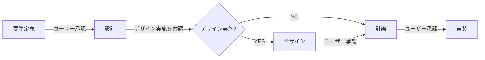
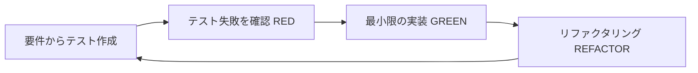

# 仕様駆動開発（SDD）ワークフロー詳細

このドキュメントはすべてのAIエージェントが従うべきワークフローの詳細定義である。
各エージェント用設定ファイル（CLAUDE.md, AGENTS.md 等）から参照される。

## プロジェクト原則（全フェーズで意識すること）

以下はフェーズに関わらず、要件定義から実装まで一貫して意識すべき横断的原則である。

### 1. DDD（ドメイン駆動設計）

- **ユビキタス言語**: ユーザー・ドメイン専門家・AIエージェント間で同一の用語を使う。要件定義の「用語集」に必ず定義し、コード・spec・テストでも同じ語を使うこと
- **境界づけられたコンテキスト**: 大きなドメインは責務ごとに分割し、`spec/design.md` で各コンテキストの境界とコンテキストマップを明示する
- **レイヤー分離**: プレゼンテーション層 / アプリケーション層 / ドメイン層 / インフラ層 を分離する。ドメイン層はフレームワーク・DBに依存させない
- **ドメインモデル中心**: エンティティ・値オブジェクト・集約・リポジトリ・ドメインサービスを `spec/design.md` のデータモデルセクションで設計する
- **腐敗防止層（ACL）**: 外部システム連携時は ACL を設け、ドメインモデルを汚染しない

### 2. セキュリティ（OWASP Top 10）

- **全フェーズでOWASP Top 10を意識する**: 要件定義段階から脅威モデリングを行い、設計でセキュリティ設計セクションを必ず埋める
- 主要観点: インジェクション / 認証・認可不備 / 機微情報露出 / XXE / アクセス制御欠陥 / セキュリティ設定ミス / XSS / 安全でないデシリアライゼーション / 既知脆弱性のあるコンポーネント / ロギング・モニタリング不足 / SSRF
- 入力検証・出力エスケープ・認可チェック・秘密情報のハードコード防止は実装の必須項目
- 詳細レビュー手順は本ファイルの「実装計画末尾の脆弱性レビュー」セクションを参照

### 3. パフォーマンス目標

- **画面表示は 100ms 以下を目標** とする（インタラクション応答のうち、ユーザー知覚レイテンシ）
  - 測定対象: TTI（Time to Interactive）/ INP（Interaction to Next Paint）/ クリック→次画面遷移 等
  - 100ms を達成できない処理はバックグラウンド化・スケルトン表示・楽観的UI更新等で知覚レイテンシを下げる
- 100ms 目標は `spec/requirements.md` の非機能要件 NFR にデフォルトで含めること
- 例外的に達成困難な要件（重い分析処理等）は、`spec/design.md` の ADR に理由とともに記録すること
- **実測はループエンジニアリングのアプローチで行うことを推奨する**: 目標達成可否を機械的に判定する「ゴールコマンド」（例: 計測結果が目標値以内なら0、超過なら非ゼロで終了するスクリプト）を用意し、ゴールコマンドが成功するまで計測→改善を反復する。手動での一度きりの確認ではなく、反復実行によって実測値で目標達成を裏付ける

### 4. ドキュメント深掘りスキル `grill-with-docs`

- 用途: ユーザー提示資料・参照ドキュメント・既存仕様の曖昧さを徹底的に質問で潰す
- 起動方法: `/grill-with-docs <対象ドキュメント or トピック>`
- 要件定義では「目的・スコープ・受け入れ基準」、設計では「制約・トレードオフ・代替案」を引き出すために使う
- **採用可否はユーザーに選択肢で確認すること（必須）**: 要件定義フェーズ・設計フェーズの開始時に、`grill-with-docs` を実施するかどうかを**選択肢ダイアログで提示**してユーザーに選んでもらう（勝手に実施・省略しない）
  - 例: 「このフェーズで `grill-with-docs`（曖昧さの深掘り）を実施しますか？ ① 実施する / ② スキップする」
  - ユーザーが「実施する」を選んだ場合のみスキルを起動する

### 5. 実行環境・計測の運用

- **サンドボックス活用（推奨）**: コマンド実行にサンドボックスが使えるツール・環境がある場合は、可能な限りサンドボックスを利用する。サンドボックスを無効化するオプション（例: `dangerouslyDisableSandbox` 相当）は、サンドボックス内で実行できない操作がある場合等、必要な場合に限定して使用する。詳細は「品質ゲート」セクションの「実行環境（サンドボックス・devcontainer）の活用」を参照
- **worktreeの積極活用**: 実装フェーズでは、`spec/plan.md` の計画単位で専用の `git worktree` を作成して作業する。main/作業中ブランチを汚さずに計画ごとの変更を分離でき、並行作業や後戻りも容易になる。詳細は「計画実行のワークフロー」を参照
- **実測はループエンジニアリングのアプローチで行う（推奨）**: 画面表示 100ms 目標など数値で検証可能なNFRは、目標達成可否を機械的に判定する「ゴールコマンド」（例: 目標未達時は非ゼロ終了する計測スクリプト）を用意し、達成するまで計測→改善を反復する。詳細は「プロジェクト原則」の「3. パフォーマンス目標」および「自己レビュー」段階2を参照

## セッション開始時の必須確認

**AIエージェントはすべてのセッション開始時に以下を実行すること:**

1. **リモートの確認・取り込み**: `git fetch` で現在の作業ブランチのリモート追跡ブランチを確認する。リモートがローカルより進んでいる場合、fast-forward可能であれば取り込んでから作業を開始する。conflict が発生する場合、またはローカルに未コミットの変更がある場合は、取り込み方針（マージ/リベース/一旦保留 等）をユーザーに確認してから進める
2. `spec/status.md` を読み、現在フェーズ・直近の状況・次のアクションを把握する
3. 把握した状況をユーザーに簡潔に伝え、認識を合わせる
4. セッション終了時には `spec/status.md` の「直近の状況」と「次のアクション」を更新する

フェーズが進んだ場合は、ユーザーの承認後に `spec/status.md` の「現在フェーズ」と「フェーズ履歴」も更新すること。

## フェーズゲート式ワークフロー

プロジェクトは以下の5フェーズで進行する（デザインフェーズはオプション）。**次のフェーズに進む前に、必ずユーザーの明示的な承認を得ること。**


```mermaid
graph LR
    A[要件定義] -->|ユーザー承認| B[設計]
    B -->|デザイン実施を確認| C{デザイン実施?}
    C -->|YES| D[デザイン]
    C -->|NO| E[計画]
    D -->|ユーザー承認| E[計画]
    E -->|ユーザー承認| F[実装]
```

```
フェーズ1: 要件定義  →（承認）→  フェーズ2: 設計
フェーズ2: 設計      →（承認＋デザイン実施確認）→  フェーズ3: デザイン（オプション）
フェーズ3: デザイン  →（承認）→  フェーズ4: 計画
（デザイン省略時は フェーズ2 →（承認）→ フェーズ4: 計画）
フェーズ4: 計画      →（承認）→  フェーズ5: 実装
```

### フェーズ1: 要件定義

**目的**: `spec/requirements.md` を完成させる

**進め方（テンプレートから新規プロジェクトを開始する場合は最初に実施）:**

テンプレートから新規プロジェクトを作成した直後は、以下のプロジェクト初期化タスクを先に実施すること:

1. `README.md` をプロジェクト内容（プロジェクト名・概要・技術スタック・セットアップ手順）に合わせて書き換える
2. `spec/requirements.md` / `spec/design.md` / `spec/plan.md` のTODOプレースホルダーをプロジェクト固有の内容に置き換え始める
3. `scripts/lint.sh` / `scripts/build.sh` / `scripts/test.sh` のTODOをプロジェクトに合わせて書き換える
4. `.github/dependabot.yml` のコメントアウトされた `package-ecosystem` から、プロジェクトで使用するもの（npm / pip / gomod 等）を有効化する
5. `spec/status.md` の「プロジェクト初期化チェックリスト」を確認し、完了したものをチェックする

初期化完了後、通常の要件定義フェーズに進む:

- ユーザーに繰り返し質問し、曖昧さ・不足がなくなるまで要件を精査する
- 推測で補完せず、不明点は必ずユーザーに確認する
- **`grill-with-docs` スキルの採用可否を選択肢でユーザーに確認する**（実施する場合: ユーザー提示資料・既存仕様の曖昧さを徹底的に深掘り）
- 以下がすべて明確になるまで完了としない:
  - プロジェクトの目的・背景
  - ターゲットユーザー
  - 機能要件（優先度付き）
  - 非機能要件（パフォーマンス、セキュリティ、可用性等）
    - **画面表示 100ms 以下** をデフォルトで NFR に含める
    - **OWASP Top 10** に基づくセキュリティ要件を含める
  - ユースケース・ユーザーストーリー
  - 用語定義（DDDのユビキタス言語の起点）
  - 受け入れ基準（各機能要件に対して）

**完了条件**: ユーザーが `spec/requirements.md` の内容を承認すること

### フェーズ2: 設計

**目的**: `spec/design.md` を完成させる

**進め方:**
- 要件定義に基づいてアーキテクチャ・データモデル・API設計等を策定する
- **DDD原則に従う**:
  - ユビキタス言語を一貫させる（要件定義の用語集を継承）
  - 境界づけられたコンテキストとコンテキストマップを定義
  - エンティティ・値オブジェクト・集約・リポジトリ・ドメインサービスを設計
  - レイヤー分離（プレゼンテーション/アプリケーション/ドメイン/インフラ）
- **OWASP Top 10 を踏まえたセキュリティ設計** を `spec/design.md` のセキュリティ設計セクションに記載する
- **パフォーマンス 100ms 目標** の達成戦略（キャッシュ・楽観的UI・バックグラウンド処理等）を明記する
- Mermaid図を活用して視覚的に表現する
- 設計の選択肢がある場合はユーザーに提示して判断を仰ぐ
- 重要な設計判断はADR（Architecture Decision Record）として記録する
- **`grill-with-docs` スキルの採用可否を選択肢でユーザーに確認する**（実施する場合: 制約・トレードオフ・代替案を引き出す）

**完了条件**: ユーザーが `spec/design.md` の内容を承認すること

**完了直後の確認（必須）**:
設計フェーズ承認後、計画フェーズへ進む前に **必ずユーザーに以下を確認すること**:

> 「デザインフェーズ（UI/UXモック作成）を実施しますか？」

- **YES** → フェーズ3（デザイン）へ進む
- **NO** → フェーズ3を省略してフェーズ4（計画）へ進む

### フェーズ3: デザイン（オプション）

**目的**: UI/UXモックを作成し、画面イメージをユーザーと合意する

**実施対象**: ユーザーが「実施する」と明示した場合のみ

**進め方:**
- 以下のいずれか（または組み合わせ）でモックを作成する:
  1. **画像生成**: 画像生成AIで画面イメージのモック画像を作成
  2. **Figma**: Figma MCP（`use_figma` / `create_new_file` 等）でデザインファイルを生成
  3. **Pencil Project**: Pencil でワイヤーフレーム/プロトタイプを作成（`.epz` ファイル）
- 主要画面・状態（正常系・エラー系・ローディング等）を網羅する
- 作成したモック・成果物は `spec/design.md` の「UI/UXデザイン」セクション、または `spec/design/` 配下に保存しリンクを残す
- デザイントークン（カラー・タイポ・スペーシング）が定まる場合は `spec/design.md` に記録する

**完了条件**: ユーザーがモックを承認すること

### フェーズ4: 計画

**目的**: `spec/plan.md` を完成させる

**進め方:**
- 設計に基づいて実装タスクを分割する
- 各計画は「1セッション＝1計画」の粒度にする
- 各計画に明確な完了条件を含める
- 計画間の依存関係を明示する
- リスク・ブロッカーを事前に特定する

**完了条件**: ユーザーが `spec/plan.md` の内容を承認すること

### フェーズ5: 実装

**進め方:**
1. `spec/plan.md` から次の計画を確認する
2. **計画専用の `git worktree` を作成し、そこで作業する**（詳細は「計画実行のワークフロー」参照）
3. 要件（`spec/requirements.md`）と設計（`spec/design.md`）を参照する
4. テストを先に書く（TDD — 詳細は後述）
5. 最小限の実装を行う
6. `bash scripts/quality-gate.sh` を実行（サンドボックスが使える場合はサンドボックス内で実行する）
7. **自己レビュー（計画単位）を実施** — 下記「自己レビュー」セクション参照
8. すべてパスしたらコミット（**MDファイルを含める**）
9. 失敗したら修正して再実行
10. specの変更が必要ならユーザーに合意を得て更新

**全計画完了時:**
- すべての計画完了後、**総合自己レビュー** と **脆弱性レビュー** を実施する（後述）

**フェーズ間の承認ルール:**
- 各フェーズの成果物をユーザーに提示し、明示的な承認を得ること
- 承認なく次のフェーズに進んではならない
- 前のフェーズに戻る必要がある場合も、ユーザーに合意を得ること

**承認後の停止・続行確認ルール（必須）:**

ユーザーから承認を得た後、**すぐに次のフェーズの作業へ進んではならない**。以下の順で進めること:

1. 承認を受けて `spec/status.md`（「現在フェーズ」「フェーズ履歴」「直近の状況」「次のアクション」）を更新する
2. **ステータス更新が完了したら、一旦作業を停止する**
3. ユーザーに「このまま次のフェーズ（例: 設計）の作業を続けてよいか」を確認する
4. ユーザーが続行を指示した場合のみ、次のフェーズの作業を開始する

> 承認は「次フェーズに進んでよい」という意思表示だが、「いま続けて作業せよ」とは限らない。
> ユーザーが一度区切って確認・休憩・別作業に移れるよう、承認・ステータス更新のたびに必ず停止して続行可否を確認する。

## 確認・質問の提示方法（選択肢ダイアログ優先）

ユーザーへの確認・質問を行う際は、**可能な限り選択肢（選択ダイアログ）形式で提示する**こと。自由記述を求める前に、想定される選択肢を提示してユーザーが選ぶだけで進められるようにする。

- 対象となる確認の例:
  - フェーズ承認後の「このまま次のフェーズの作業を続けてよいか」（① 続ける / ② ここで一旦止める 等）
  - 「デザインフェーズ（UI/UXモック作成）を実施するか」（① 実施する / ② 省略する）
  - 「`grill-with-docs` を実施するか」（① 実施する / ② スキップする）
  - 設計・技術選定の選択肢提示、次に着手する作業の選択 等
- 各選択肢には簡潔な説明（メリット・影響）を添える
- 推奨がある場合は推奨案を先頭に置き「（推奨）」と明示する
- 選択肢で表現しきれない自由記述が必要な事項のみ、記述で確認する

## 作業完了後の報告ルール（次の作業の提示）

各作業（フェーズ作業・計画単位の実装・タスク）を完了したら、完了報告とあわせて**次に何をするかを必ず示す**こと:

- **次の作業がある場合**: 完了した内容を簡潔に伝えたうえで、「次の作業」（次の計画・次のタスク・次のフェーズ等）を具体的に提示する
- **次の作業がない場合**: すべて完了した旨を明示し、プロジェクト/フェーズが完了状態にあることを伝える
- 次の作業の提示後は、前述の「承認後の停止・続行確認ルール」に従い、続行してよいかを確認してからその作業に着手する

## レビュー結果の説明ルール（要点をわかりやすく）

自己レビュー（計画単位・総合）および脆弱性レビューを実施したら、**チェックリストの結果を内部で完結させず、要点をユーザーにわかりやすく説明する**こと:

- 何をレビューしたか（対象・観点）を1〜2文で示す
- **重要な発見・指摘・リスク**を箇条書きで要点として伝える（専門用語は平易に補足する）
- 問題がなかった場合も「特に問題なし」と明示する
- 検出した問題に対して**取った対応 / これから取るべき対応**を示す
- 詳細な全チェックリストの羅列ではなく、ユーザーが判断に使える要点に絞ること

## TDD（テスト駆動開発）ガイドライン

AIエージェントによる開発では、TDDが特に重要である。テストはAIの出力品質を保証する最も効果的な手段である。

### TDDサイクル


```mermaid
graph LR
    A[要件からテスト作成] --> B[テスト失敗を確認 RED]
    B --> C[最小限の実装 GREEN]
    C --> D[リファクタリング REFACTOR]
    D --> A
```

### AIエージェント向けTDDルール

1. **テストは要件のみから作成する**: 実装コードを見ずに、`spec/requirements.md` の要件・受け入れ基準からテストを書く
2. **テスト失敗を確認してから実装**: テストが RED であることを確認してから実装を開始する
3. **振る舞いベーステスト**: 内部実装ではなく、外部から観測可能な振る舞いをテストする
4. **エッジケースを網羅する**: 正常系だけでなく、境界値・異常系・エラーケースもテストする
5. **テストの独立性**: 各テストは他のテストに依存せず、単独で実行可能であること
6. **テストなしのコードをコミットしてはならない**

### テスト戦略

| テスト種別 | 対象 | タイミング |
|-----------|------|-----------|
| 単体テスト | 個別の関数・メソッド | 各計画の実装時 |
| 結合テスト | モジュール間の連携 | 関連する計画完了時 |
| E2Eテスト | ユーザーシナリオ全体 | 機能完成時 |

## spec管理ルール

### ドキュメント構成

| ファイル | 内容 |
|----------|------|
| `spec/requirements.md` | 要件定義（ユーザーストーリー、機能要件、非機能要件） |
| `spec/design.md` | 設計（アーキテクチャ、データモデル、状態遷移、API設計、ADR） |
| `spec/plan.md` | 実装計画（セッション単位のタスク分割） |
| `spec/status.md` | 進行ステータス（現在フェーズ・直近状況・次アクション・初期化チェックリスト） |
| `spec/workflow.md` | このファイル（ワークフロー定義、参照用） |

**ルール:**
- 各ドキュメントは原則1ファイル（Markdown＋Mermaid図）で管理する
- 内容が膨大になった場合のみファイルを分割してよい（例: `spec/requirements-auth.md`）
- Mermaid図を積極的に活用し、視覚的に理解しやすくすること

### spec変更時のユーザー合意

- `spec/` 内のファイル変更が必要になった場合、**必ずユーザーに変更内容を提示し、合意を得てから変更すること**
- ユーザーの合意なくspecファイルを変更してはならない

## 計画の粒度と実行

### 1セッション＝1計画の原則

- `spec/plan.md` の各計画は、AIエージェントの1回のセッションで完了できるサイズに分割すること
- 計画には明確な完了条件（テスト・品質ゲートで検証可能）を含めること
- 計画が大きすぎる場合はさらに分割すること

### 粒度の目安

- **小**: 単一関数・コンポーネントの追加（1-3ファイル変更）
- **中**: 1機能の実装（3-7ファイル変更）
- **大**: 複数機能にまたがる変更 → **分割を検討すること**

### 計画実行のワークフロー

1. `spec/plan.md` から次の計画を確認する
2. **計画専用の `git worktree` を作成する**（例: `git worktree add ../<project>-plan-<n> -b plan/<n>-<slug>`）。main/作業中ブランチを汚さずに計画単位で作業を分離するため、実装フェーズでは原則としてこのworktree内で作業する
3. 計画の内容に基づいてTDDで実装する
4. 品質ゲートを実行する（サンドボックスが使える場合はサンドボックス内で実行する）
5. **計画の実行後、必ずコミットを行うこと**（計画実行中に生成されたMDファイルも含める）
6. 計画完了後は「作業完了後の報告ルール」に従い、**次の計画（なければ完了の旨）をユーザーに提示** する
7. 計画がマージ・完了したら、不要になった worktree を整理する（`git worktree remove`）

## 自己レビュー（必須・2段階）

AIエージェントは実装後に自己レビューを行い、品質ゲートでは検出できない設計・ロジック・読みやすさ・要件適合性の観点を自ら検証すること。

### 段階1: 計画単位の自己レビュー（各計画の実装完了時）

各計画の実装完了後、**コミット前** に以下を必ず実施する:

- [ ] 当該計画の**完了条件をすべて満たしている**ことを確認した
- [ ] `spec/requirements.md` の関連する受け入れ基準を満たしている
- [ ] `spec/design.md` の設計方針（DDDレイヤー分離・境界づけられたコンテキスト・ユビキタス言語）から逸脱していない
- [ ] **OWASP Top 10** 観点で当該変更を確認した（入力検証・認可・出力エスケープ・秘密情報露出）
- [ ] **画面表示 100ms 目標** に影響する変更（重い同期処理・N+1クエリ・巨大バンドル等）がないか確認した
- [ ] テストが振る舞いベースで書かれており、内部実装変更で壊れないこと
- [ ] 死コード・未使用インポート・デバッグ出力・TODOの取り残しがない
- [ ] エラーハンドリングが `spec/design.md` のエラーハンドリング方針に沿っている

自己レビューの記録は不要だが、不適合を発見した場合は **コミット前に修正** すること。
レビュー後は「レビュー結果の説明ルール」に従い、**要点をユーザーにわかりやすく説明** すること。

### 段階2: 総合自己レビュー（全計画完了時）

`spec/plan.md` のすべての計画完了後、脆弱性レビューと並行して以下の総合自己レビューを実施する:

- [ ] **要件適合性**: `spec/requirements.md` のすべての機能要件・受け入れ基準を満たした
- [ ] **設計整合性**: 実装が `spec/design.md` の設計と乖離していない（乖離がある場合は spec を更新済み）
- [ ] **DDD整合性**: レイヤー分離・ユビキタス言語・集約境界が崩れていない
- [ ] **NFR達成**: 画面表示 100ms 目標を、ゴールコマンド等によるループエンジニアリング（反復実測）で測定し、達成または許容範囲であることを確認した
- [ ] **セキュリティ**: OWASP Top 10 各カテゴリで重大な漏れがない
- [ ] **テスト網羅性**: 主要なユーザーストーリーがE2E/結合テストで覆われている
- [ ] **ドキュメント**: `spec/plan.md` の全チェックボックス更新済み、`spec/status.md` 更新済み

総合自己レビューの結果は **PR本文または `spec/plan.md` 末尾に記録** し、あわせて「レビュー結果の説明ルール」に従って**要点をユーザーにわかりやすく説明** すること。

## 実装計画末尾の脆弱性レビュー（必須）

`spec/plan.md` の **すべての計画を完了した直後**、リリース/マージ前に必ず以下の脆弱性レビューを実施すること。これは実装計画の最終ステップとして固定する。

### 観点

1. **実装の脆弱性レビュー**
   - OWASP Top 10（インジェクション、XSS、認証/認可不備、機微情報露出、SSRF 等）
   - 入力検証・出力エスケープ・認可チェックの抜け漏れ
   - 秘密情報のハードコード、ログ流出、不要な権限付与
   - 依存ライブラリの安全でない使い方（既知の危険関数等）

2. **パッケージの脆弱性レビュー**
   - 言語標準の脆弱性スキャナを実行する:
     - npm: `npm audit`
     - pnpm: `pnpm audit`
     - Bun: `bun audit`
     - pip: `pip-audit`
     - Go: `govulncheck ./...`
     - Cargo: `cargo audit`
   - GitHub の Security タブ（Dependabot アラート）を確認する
   - High / Critical の脆弱性は **マージ前に解消する**

### 完了条件

- [ ] 実装の脆弱性レビュー結果を `spec/plan.md` 末尾またはPR本文に記録した
- [ ] パッケージの脆弱性スキャナを実行し、結果（クリーン or 検出内容と対応）を記録した
- [ ] High / Critical の脆弱性がすべて解消、または明示的に保留判断（理由付き）されている
- [ ] レビューの要点（検出した脆弱性・リスク・取った対応）を「レビュー結果の説明ルール」に従ってユーザーにわかりやすく説明した

## 品質ゲート

### 自動強制（pre-commitフック）

コミット時に品質ゲートが**自動実行**される。品質ゲートを通過しない限り、gitがコミットを拒否する。

**品質ゲートの内容（順に実行、1つでも失敗でコミット拒否）:**
1. `scripts/lint.sh` — リント・静的解析
2. `scripts/build.sh` — ビルド確認
3. `scripts/test.sh` — 単体テスト・結合テスト

**手動で事前確認:** `bash scripts/quality-gate.sh`

**`--no-verify` でのフックスキップは禁止。** 品質ゲートを回避するコミットは許されない。

### 実行環境（サンドボックス・devcontainer）の活用（推奨）

コマンド実行にサンドボックスが使えるツール・環境がある場合は、可能な限りサンドボックスを利用することを推奨する。誤操作や意図しない副作用から作業環境・ホストを守り、再現性の高い実行結果を得られる。サンドボックスを無効化するオプション（例: `dangerouslyDisableSandbox` 相当）は、サンドボックス内では実行できない操作がある場合など、必要な場合に限定して使用すること。

テスト実行は devcontainer 内で行うことも推奨する。これにより、環境差異によるテスト失敗を防ぎ、CI/CD と同一環境で品質ゲートを通過できる。

```bash
# devcontainer 内でテストを実行
devcontainer exec --workspace-folder . bash scripts/test.sh

# devcontainer 内で品質ゲート全体を実行
devcontainer exec --workspace-folder . bash scripts/quality-gate.sh
```

### 初回セットアップ

```bash
bash scripts/setup-hooks.sh
```

## コミットメッセージ規約

コミットメッセージは**日本語**で記述すること:

```
<種別>: <変更内容の要約>

<詳細な説明（必要に応じて）>
```

**種別:**

| 種別 | 用途 |
|------|------|
| `機能` | 新機能の追加 |
| `修正` | バグ修正 |
| `改善` | 既存機能の改善 |
| `整理` | リファクタリング・コード整理 |
| `テスト` | テストの追加・修正 |
| `文書` | ドキュメントの変更 |
| `設定` | 設定ファイルの変更 |
| `計画` | 計画の追加・更新 |

## コード品質

- 既存ファイルの編集を優先し、不要なファイル作成を避ける
- セキュリティ脆弱性（インジェクション、XSS等）を絶対に入れない
- 過剰設計をしない。現在の要件に必要な最小限の複雑さに留める
- 未使用のコード・変数・インポートを残さない

## 依存パッケージの脆弱性チェック（Dependabot）

`.github/dependabot.yml` で **週1回（毎週月曜 09:00 JST）** にDependabotが各パッケージエコシステムを走査する。

- 検出された脆弱性に対して Dependabot が自動的に **更新PRを作成** する
- GitHub の **Security タブ**（Dependabot alerts）に脆弱性情報が一覧表示される
- 新規プロジェクトを作成したら、`.github/dependabot.yml` のコメントアウトされた `package-ecosystem` から、使用するもの（npm / pip / gomod 等）を有効化すること
- 作成されたPRは **品質ゲート（pre-commit）と同等の検証** を実施してからマージすること
- High / Critical のアラートは原則として速やかに解消する

## PR作成ルール

PRを作成する際は `.github/PULL_REQUEST_TEMPLATE.md` のテンプレートに従うこと:
- 概要セクション必須
- チェックリスト全項目を確認
- テスト計画を記載

## よくある失敗パターンと対策

| 失敗パターン | 対策 |
|-------------|------|
| specを読まずに実装を開始する | 実装前に必ず `spec/requirements.md` と `spec/design.md` を参照する |
| テストを後から書く | TDDサイクルを厳守する。テストが RED であることを確認してから実装 |
| 計画が大きすぎて1セッションで完了しない | 計画の粒度ガイドラインに従い、事前に分割する |
| specを勝手に変更する | spec変更は必ずユーザーの合意を得てから行う |
| MDファイルをコミットから漏らす | コミット前に `git status` で変更されたMDファイルを確認する |
| 品質ゲートを回避する | `--no-verify` は禁止。品質ゲートの失敗は根本原因を修正する |
| エラーハンドリングが不十分 | 外部入力・API境界では必ずバリデーションとエラー処理を行う |
| セキュリティの考慮漏れ | OWASP Top 10を全フェーズで意識し、入力検証・認証・認可を確認する |
| 自己レビューをスキップしてコミット | 計画単位の自己レビューチェックリストを必ず実施してからコミット |
| 設計フェーズ後にデザイン実施を確認しない | 設計承認直後に「デザインフェーズを実施しますか？」を必ず質問する |
| ユビキタス言語が用語集とコードでバラつく | 要件定義の用語集を起点に、設計・コードで同じ語を使う |
| 画面が遅いまま放置 | 100ms目標を意識し、達成困難な処理は楽観的UI・スケルトン等で知覚レイテンシを下げる |
| リモートを確認せずセッションを開始する | セッション開始時に必ず `git fetch` でリモートを確認し、進んでいれば取り込んでから作業する |
| 計画をmainや共有ブランチ上で直接進めてしまう | 計画開始時に専用の `git worktree` を作成し、そこで作業する |
| NFR達成を一度きりの手動確認で済ませる | ゴールコマンド等を用いたループエンジニアリングで反復実測し、達成を裏付ける |

## 技術スタック（デフォルト選定）

プロジェクト開始時、以下をデフォルトとして採用する。プロジェクト固有の要件で変更する場合は `spec/design.md` の技術選定セクションに理由を記録すること。

### 基本技術選定

| 用途 | 言語・フレームワーク |
|------|----------------------|
| Web | TypeScript & Next.js |
| バックエンド | Go |
| 機械学習 | Python |
| デスクトップ（Windows） | WinUI（C#） |
| デスクトップ（Mac） | SwiftUI（Swift） |
| Android | Kotlin |
| iOS | Swift |

### 共通ルール

- **認証**: Google認証を採用する
- **ライブラリ・フレームワークのバージョン**: `date` コマンドで現在日付を取得し、**その日付の3日前時点で公開されていた最新安定版**を採用する（リリース直後の不安定な版を避けるため）
  - 例: 今日が 2026-05-17 ならば、2026-05-14 時点で公開済みの最新安定版を選ぶ
  - パッケージマネージャで `--before` 相当の指定ができない場合は、レジストリ（npm registry / PyPI / pkg.go.dev 等）で公開日を確認すること

### 言語別ルール

#### TypeScript
- **フルスタック**: Next.js
- **バックエンド分離時**: Bun × Hono
- **テスト**: Bun Test
- **静的解析**: Biome
- **実行環境**: Bun

#### C#
- WinUI を使う

#### Swift
- SwiftUI を使う

### インフラ

- **DB**: NeonDB を優先
- **ホスティング**: Vercel を優先
- **メールサーバー**: SMTP
- **その他**: Cloudflare / Netlify / ConoHa VPS / ロリポップ
